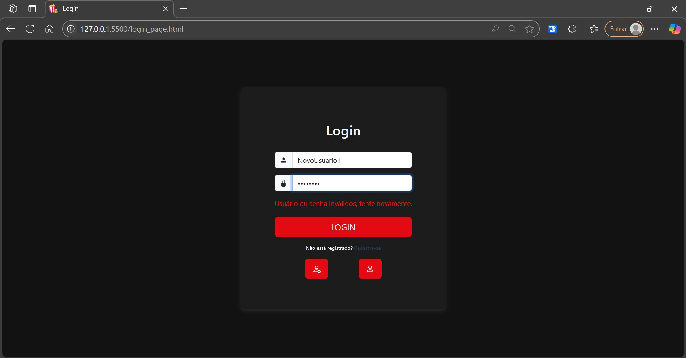

# CineAPI

CineAPI é uma API REST completa para gerenciamente de filmes, oferecendo funcionalidades como:  
 📌 Cadastro, edição, exclusão, busca e filtragem de filmes.   
 📌 Sistema de autenticação com registro e login.  
 📌 Geração de **TOKEN JWT** no login, com tempo expiração.  
 📌 Sistema de roles de acesso, com **user** e **admin**, que controlam as permissões do usuário.  
 📌 Possibilidade do usuário favoritar seus filmes preferidos.  

## 🚀 Tecnologias 
 - Java
 - Spring Boot
 - PostgreSQL
 - HTML
 - CSS
 - JavaScript
 - Bootstrap

## Imagens

